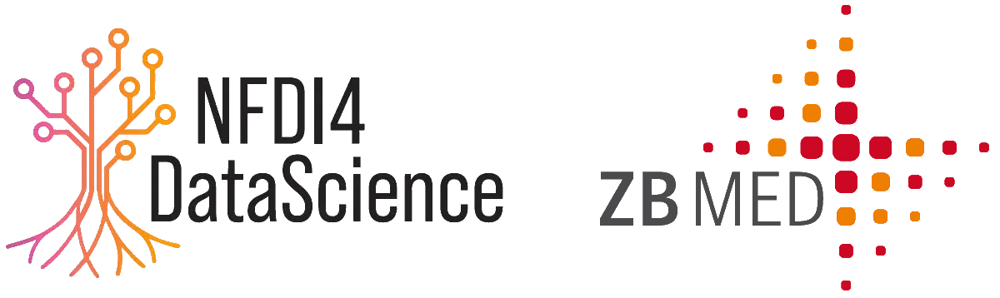

# NFDI4DS Hackathons at ZB MED

Hackathons offer a space to create and develop ideas in a fast-paced collaborative environment during a couple of days. As part of the [NFDI4DS](https://www.nfdi4datascience.de/) project, [ZB MED](https://www.zbmed.de/en/) organizes hackathons around subjects related to metadata for research artifacts. We use these pages as an entry point where people can find more information about them. 

Follow us on Mastodon @ZBMED@mastodon.social @NFDI4DS@nfdi.social